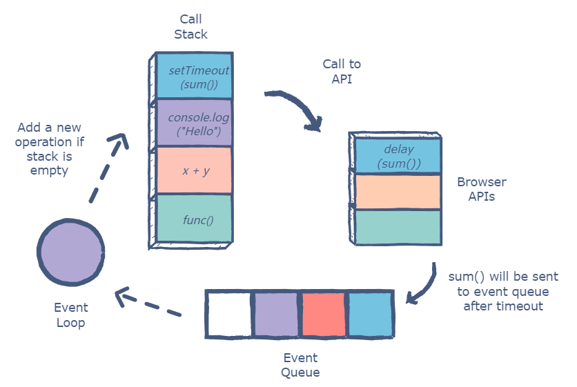

## 浏览器的进程模型

JavaScript 是一个单线程的脚本语言，同一时间只能做一件事情。而为了协调事件、用户交互、脚本、渲染、网络等等，每个浏览器都有一个相关联的事件循环。

事件循环的一个循环将从宏任务队列中正在处理一个任务(这个队列在 WHATWG 规范中简称为任务队列)。在这个宏任务完成之后，所有可用的微任务都将被处理，即在同一个周期内。在处理这些微任务时，它们可以排列更多的微任务，这些任务将一个接一个地运行，直到微任务队列耗尽。

一个事件循环有一些任务队列。微任务队列不是任务队列

函数调用会形成一个调用栈，当函数调用结束后，当前函数会被弹出调用栈。

在函数执行的过程中，如果有异步任务，它们会发送给 web APIs，比如 settimeout 函数，当它在栈中执行时，会发送给对应的浏览器 API，在等待相应的时间后，他就会将回调函数放入事件队列。

> JavaScript 本身是一个单线程的，但是 web APIs 相当于另一个线程。

事件循环会总是检查调用栈是否为空，如果为空，它就会将队列最前面的任务出队，放入执行栈中调用，如果不为空，那么继续执行当前的函数调用。

异步任务的返回结果会被放到一个任务队列中，根据异步事件的类型，这个事件实际上会被放到对应的宏任务和微任务队列中去。

简单总结一下执行的顺序：

1. 检查宏任务队列是否为空，不为空则取出一个任务执行，然后执行第 2 步；为空则判断当前执行栈是否为空，然后执行第 2 步；
2. 检查微任务队列是否为空，不为空则取出任务执行，直到清空微任务队列，之后执行视图更新；为空则直接执行视图更新，并回到第一步。

宏任务：

1. 整个 script 中的代码
2. setTimeout
3. setInterval
4. I/O
5. UI 交互事件

微任务：

1. promise.then .catch
2. mutationObserver
3. async await